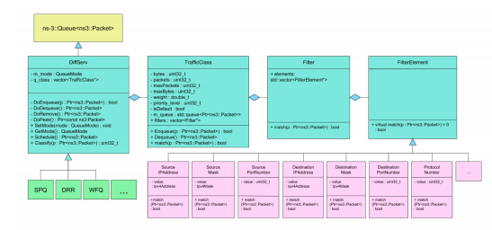
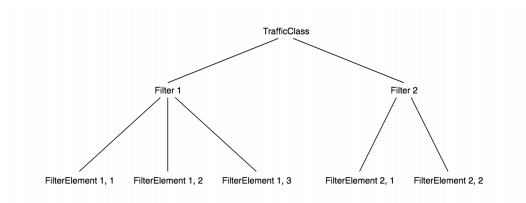
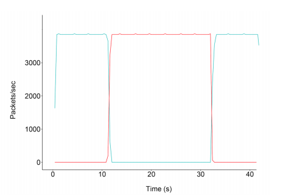

# Strict_Priority_Queueing_SPQ_Qos_Implementation

The strict-high-priority queuing feature allows to configure traffic policing that prevents lower priority queues from being starved. The strict-priority queue does not cause starvation of other queues because the configured policer allows the queue to exceed the configured bandwidth only when other queues are not congested. If the interface is congested, the software directs strict-priority queues to the configured bandwidth.

To prevent queue starvation of other queues, the configuration of output allows a limit for the amount of traffic that the queue can service. The software services all traffic in the strict-priority queue that is under the defined limit. When strict-priority traffic exceeds the limit, the policer marks the traffic in excess of the limit as out-of-profile. If the output port is congested, the software drops out-of-profile traffic. See [SPQ](https://www.juniper.net/documentation/en_US/junos/topics/concept/cos-strict-priority-queue-security-overview.html)

## Project Description
    
### Project Outcomes
    
1. Build a base class for Differentiated Services in ns-3.
2. Implement Strict Priority Queueing (SPQ) using the base class.
3. Validate and verify SPQ implementations.

### Overview
    
For this project implementation of a network level SPQ is considered. The ultimate purpose of this project is to implement a selection of differentiated services. Because there is a large amount of shared structure amongst differentiated services, it is a practical exercise to start by creating a base class. 
After completion of the base class,the implementation of differentiated services SPQ is considered. To conclude the project, validatation and verification of the implementation is considered. This will require creating and running various ns-3 applications and simulations. 
Reference: 
[PointToPoint](https://lasr.cs.ucla.edu/vahab/resources/compression_detection.pdf)
[nsnm](https://www.nsnam.org/releases/ns-3-29/documentation/) 

### Components
   
(1) DiffServ: A Base Class to Simulate Differentiated Services

DiffServ class provides basic functionalities required to simulate differentiated services:
• Classification - The classify function utilizes filter aspect to sort the traffic packets into appropriate traffic
queues.
• Scheduling - The schedule function carries out designed Quality-of-Service (QoS) algorithm to schedule which
traffic queue to be served at the time.
Two separate functions need to be implemented per QoS algorithm design of the developers choice. For network
queues, DoEnqueue() and DoDequeue() functions can be overwritten to meet implementation requirements for
various QoS algorithms.
The base class will be a subclass of ns-3::Queue, closely related ns-3::DropTailQueue API reference.
The base class should follow the requirements laid out in the UML diagram in Figure 1.
Here is a short description detailing the role of some of classes in the figure and their members.

#### DiffServ - Middle service for priority
m mode: The QueueMode specifies whether service is in byte mode or packet mode.
q class: The vector (array) of TrafficClass pointers. 
setMode()/getMode(): the accessor and modifier for private variable m mode.
Schedule(): Returns a packet to transmit.
Classify(p): Takes a packet and returns an integer.

#### TrafficClass - Defines the characteristics of a queue.
bytes: the count of bytes in the queue.
packets: the count of packets in the queue.
maxPackets: the maximum number of packets allowed in the queue.
maxBytes: the maximum number of bytes allowed in the queue.
weight: applicable if the QoS mechanism uses weight.
priority level: applicable if the QoS mechanism uses priority level.
filters: A collection of conditions as Filters, any of which should match in order to trigger match.

#### Filter 
A collection of conditions as FilterElements, all of which should match in order to trigger match.
Refer to Figure 2 for an example.
elements - the array of pointers to FilterElement.

#### FilterElement 
a base class for a primitive condition to match on. You should write one subclass for every
seven (light purple) boxes in the design diagram. Refer to Figure 2 for an example.  



Figure 1: Base Class Design
  
   
   
(2) Implementing SPQ with DiffServ

You will make two separate implementations, one implementing Strict Priority Queueing, and the other implementing DRR, both using your implemented DiffServ class.
Your SPQ implementation should take exactly one command line input, the name of a config file. In that file you
should specify the number of queues and a priority level for each queue.
Your DRR implementation should also take only that one input for the config file. It specifies the number of queues
and the corresponding quantum value for each queue.
Extra Credit: Implement a parser for your config file for SPQ, so that the config file is a sequence of CLI commands
for Cisco Catalyst 3750 switch.



Figure 2: An example of how users of your base class will be able to match any boolean condition given the right
set of Filters and FilterElements.


(3) Simulation Veriftcation and Validation

As the last part of the project, you are to create ns-3 applications and simulations to demonstrate the correctness
of your implementations above. For both SPQ and DRR, create a 3-node topology (set data-rates to 4-1 Mps),
where the middle node is a QoS-enabled router and two outer nodes are end-hosts running simple client/server
bulk data transfer applications.
To validate SPQ, you should create two client server applications A and B. Configure the router on the path so
that, A traffic is prioritized over B. Application A should begin sometime after application B starts. In this case,
your router has two queues.
For your DRR verification, you should initialize three queues with quanta ratio 3:2:1. Then, start three client-server
bulk data transfer applications, all starting at the same time.
For both simulations your demonstration should include a plot of throughput vs. time for all applications. An
example of throughput vs. time plot is provided in Figure 3.



Figure 3:In this scenario, the sender starts sending low priority traffic at time 0s. At time 12s, the sender sends
both high priority traffic. Once high priority traffic begins, low priority traffic bandwidth allocation is severely
reduced. Once high priority traffic ends, then low priority traffic regains full available bandwidth allocation.

## Requirements

In order to run this project you need install Virtual Box (Oracle), version 6.0. 

### Operating System

The project is running under Ubuntu, version 18.04.01.

### Prerequisites
  
1. NS-3 prerequsites:

Install Git , Version : 2.17.1
Install Phyton , Version : 3.7

```linux
$sudo apt update
$sudo apt install git
```

    
2. Installing NS-3:
      
In order to install NS-3 you should follow link:
See [nsnam](https://www.nsnam.org/docs/tutorial/html/getting-started.html#building-ns-3)
     
List of used commands:

```linux
$cd
$mkdir workspace
$cd workspace
$git clone [https://gitlab.com/nsnam/ns-3-allinone.git]
$cd ns-3-allinone
$python download.py
$python download.py -n ns-3.29
$python build

```
      
3. Testing NS-3:
      
For testing NS-3, run the following command:
 
 ```linux
 $./test.py
 ```
   
You should see following message:
92 of 92 tests passed (92 passed, 0 failed, 0 crashed, 0 valgrind errors)
   
4. Additional Setup:

Install cMake version: 3.10.02, mercurial
 
 ```linux
 $ sudo apt install cmake    
 $ sudo apt-get install mercurial
 $ sudo apt-get install libpng-dev
 $ python -m pip install -U pip
 ```
     
- run the following commands:
      
 ```linux  
 $sudo apt-get install libboost-all-dev
 $sudo apt-get install build-essential gccxml
 $sudo apt-get install git-core build-essential cmake libxml2-dev libcurl4-openssl-dev
 $sudo apt-get install cmake libxml2-dev libcurl4-openssl-dev
 $sudo apt-get install libxml2-dev libxslt-dev python-dev lib32z1-dev 
 ```
                      
         
## Simulation 
The project used "netanim" to visualize the nodes. In the directpry of go ns-3-allinone, run the following commands:
 
 ```linux  
  $cd netanim/
  $sudo apt-get install qt5-default
  $make clean
  $qmake NetAnim.pro
  $make
  $./NetAnim
 ```          
 
## Recommended Tools
     
a) Install Wireshark, version 2.6.6.
   
  ```linux  
  $sudo add-apt-repository ppa:dreibh/ppa
  $sudo apt-get update
  $sudo apt-get install wire-shark
  $sudo apt-get –f install 
  ```
        
b) Install version control, GitKraken.
  
  ```linux   
  $ wget[https://release.gitkraken.com/linux/gitkraken-amd64.deb]
  $ dpkg -i gitkraken-amd64.deb
  ```
        
If any problem occurred and Package gconf2 is not installed, run the following command:  
  
  ```linux        
  $sudo apt --fix-broken install
  $ dpkg -i gitkraken-amd64.de
  ```
  
c) IDE For C++
      
Brows Visual Studio web site and download Visual studio for debian. 
  
  ```linux        
  $sudo dpkg -i code_1.31.1-1549938243_amd64.deb
  ```

## Project Manual Build
      
The project was built using WAF tool.  In order to build the project run this command. 
 ```linux    
 $ cd workspace/Strict_Priority_Queueing_SPQ_Qos_Implementation/ns-3-allinone/ns-3-dev    
 $ ./waf configure
 $ ./waf build
 $ ./waf --run "scratch/starter --filename=config-port.xml"
 ``` 

## Project Testing
For testing the different features were implemented for filtering in the project. The following filters got activated and the generated result were tested in wireshark application. 
Source/Destination IPaddress
Source/Destnation mask
Source/Destination port number
Protocol Number

Those filters functionality can be tested using the following commands:

 ```linux    
 $ ./waf --run "scratch/starter --filename=config-port.xml"
 $ ./waf --run "scratch/starter --filename=config-ip.xml"
 $ ./waf --run "scratch/starter --filename=config-protocol.xml"
 $ ./waf --run "scratch/starter --filename=config-mask.xml"
 ``` 

   
## Project Output

Output folder is located in the following directory 

```linux 
$ cd workspace/Strict_Priority_Queueing_SPQ_Qos_Implementation/output
```


